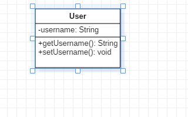

### **一、类的属性的表示方式**

在UML类图中，类使用包含类名、属性(field) 和方法(method) 且带有分割线的矩形来表示，比如下图表示一个Employee类，它包含name,age和email这3个属性，以及modifyInfo()方法。

那么属性/方法名称前加的加号和减号是什么意思呢？它们表示了这个属性或方法的可见性，UML类图中表示可见性的符号有三种：

- `+` 表示public
- ``-``表示private
- ``#``表示protected

实际上，属性的完整表示方式是这样的：

> **可见性  名称 ：类型 [ = 缺省值]**

中括号中的内容表示是可选的

### 二、 类图中的6种关系

- 关联（Association）
- 聚合（Aggregation）
- 组合（Composition）
- 依赖（Dependency）
- 泛化（Generalization）
- 实现（Realization）

| 关系   |                                          |
| ---- | ---------------------------------------- |
| 关联   | 一种拥有的关系，它使一个类知道另一个类的属性和方法；如：老师与学生，丈夫与妻子关联可以是双向的，也可以是单向的。双向的关联可以有两个箭头或者没有箭头，单向的关联有一个箭头。 |
| 聚合   | 整体与部分的关系，且部分可以离开整体而单独存在。如车和轮胎是整体和部分的关系，轮胎离开车仍然可以存在。聚合关系是关联关系的一种，是强的关联关系；关联和聚合在语法上无法区分，必须考察具体的逻辑关系组合。 |
| 组合   | 是整体与部分的关系，但部分不能离开整体而单独存在。如公司和部门是整体和部分的关系，没有公司就不存在部门。组合关系是关联关系的一种，是比聚合关系还要强的关系，它要求普通的聚合关系中代表整体的对象负责代表部分的对象的生命周期。 |
| 依赖   | 一种使用的关系，即一个类的实现需要另一个类的协助，所以要尽量不使用双向的互相依赖. |
| 泛化   | 一种继承关系，表示一般与特殊的关系，它指定了子类如何特化父类的所有特征和行为。例如：老虎是动物的一种，即有老虎的特性也有动物的共性。 |
| 实现   | 一种类与接口的关系，表示类是接口所有特征和行为的实现。              |

