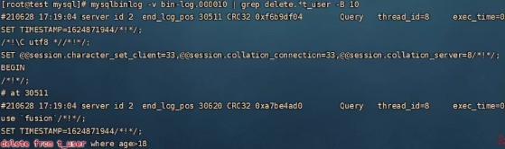

## binglog 日志 

binlog 即 Binary Log，它是二进制文件，用来记录数据库写操作的日志。

数据库的 insert、delete、update、create、alter、drop 等写入操作都会被 binlog 记录。

因此，数据库的主从数据同步通常也是基于 binlog 完成的，本文只对 binlog 做一些简单介绍，后期会单独写一篇文章讲基于 binlog 的主从数据同步。

binlog 日志需要配置开启，可以通过脚本查看 binlog 是否开启。

```shell
SHOW VARIABLES LIKE 'LOG_BIN%';
```

如果`log_bin`参数显示的是`OFF`说明 binlog 是关闭状态，需要手动开启。

开启 binlog 需要修改数据库的`my.cnf`配置文件，my.cnf文件通常在服务器的`/etc`目录下。

打开`/etc/my.cnf`文件，配置 binlog 的相关参数，下文配置 binlog 的常用参数。

```shell
# 启用binlog并设置binlog日志的存储目录
log_bin = /var/lib/mysql/bin-log
# 设置binlog索引存储目录
log_bin_index = /var/lib/mysql/mysql-bin.index
# 30天之前的日志自动删除
expire_logs_days = 30
# 设置binlog日志模式，共有3种模式：STATMENT、ROW、MIXED
 binlog_format = row
```

binlog 的日志有三种格式，分别是 STATEMENT、ROW、MIXED。在 mysql5.7.7 版本之前默认使用的是 STATEMENT，之后的版本默认使用的是 ROW。

### ROW 格式

ROW 格式下，binlog 记录的是每一条数据被修改的详细细节。

比如，执行 delete 语句，删除的数据有多少条，binlog 中就记录有多少条伪 sql。

```sh
delete from t_user where age>18;
```


那么 row 格式的日志的缺点就很明显，在发生批量操作时，日志文件中会记录大量的伪 sql，占用较多的磁盘空间。

尤其是当进行 alter 操作时，每条数据都发生变化，日志文件中就会有每一条的数据的日志。此时，如果表中的数据量很大的话，日志文件也会非常大。

在 mysql5.6 版本之后，针对 ROW 格式的日志，新增了`binlog_row_image`参数。

当`binlog_row_image`设置为`minimal`时，日志中只会记录发生改变的列，而不是全部的列，这在一定程度上能减少 binlog 日志的大小。

虽然记录每行数据的变化会造成日志文件过大，但这也是它的优点所在。

因为它记录了每条数据修改细节，所以在一些极端情况下也不会出现数据错乱的问题。在做数据恢复或主从同步时能很好的保证数据的真实性和一致性

### STATEMENT 格式

STATEMENT 格式下，日志中记录的是真正的 sql 语句，就像是这样。




日志中的 sql 是直接可以拿到数据库运行的。

STATEMENT 格式的日志的优缺点和 ROW 格式的正好相反，它记录的是 sql 语句和执行语句时的上下文环境，而不是每一条数据。所以它的日志文件会比 ROW 格式的日志文件小一些。

由于记录的只是 sql 语句和上下文的环境，STATEMENT 格式的日志在进行主从数据同步时会有一些不可预估的情况出现，导致数据错乱。比如 sleep()、last_insert_id() 等函数会出现问题。

### MIXED 格式

MIXED 格式是 STATEMENT 和 ROW 的结合，mysql 会根据具体执行的 sql 语句，来选择合适的日志格式进行记录。

MIXED 格式下，在执行普通的 sql 语句时会选 STATEMENT 来记录日志，在遇到复杂的语句或函数操作时会选择 ROW 来记录日志。

## msyql binlog命令

mysql 数据库的 binlog 文件是二进制的，基本看不懂，使用数据库自带的`mysqlbinlog`命令可以把二进制文件转换成能看懂的十进制文件。

由于数据库的 binlog 文件可能会很大，查看起来会很麻烦，所以`mysqlbinlog`命令也提供了一些参数可以用来筛选日志。

**「mysqlbinlog 语法」**

```shell
mysqlbinlog [options] log-files
```

> `options`：可选参数`log-files`：文件名称

**「options 的常用值」**

> `-d`: 根据数据库的名称筛选日志
>
> `-o`：跳过前N行日志
>
> `-r, --result-fil`: 把日志输出到指定文件
>
> `--start-datetime`: 读取指定时间之后的日志，时间格式：yyyy-MM-dd HH:mm:ss
>
> `--stop-datetime`: 读取指定时间之前的日志，时间格式：yyyy-MM-dd HH:mm:ss
>
> `--start-position`: 从指定位置开始读取日志
>
> `--stop-position`: 读取到指定位置停止
>
> `--base64-output`：在 row 格式下，显示伪 sql 语句
>
> `-v, --verbose`：显示伪 sql 语句，-vv 可以为 sql 语句添加备注

**「常用写法」**查看 fusion 数据库的日志

```she
mysqlbinlog -d=fusion bin-log.000001
```

查看某个时间段内的日志

```she
mysqlbinlog  --start-datetime='2021-06-09 19:30:00' --stop-datetime='2021-06-09 19:50:00' bin-log.000001
```

恢复数据，事件的开始位置是 4300，结束位置是 10345

```shell
mysqlbinlog --start-position 4300 --stop-position 10345 bin-log.000001 | mysql -uroot -p123456 fusion
```

