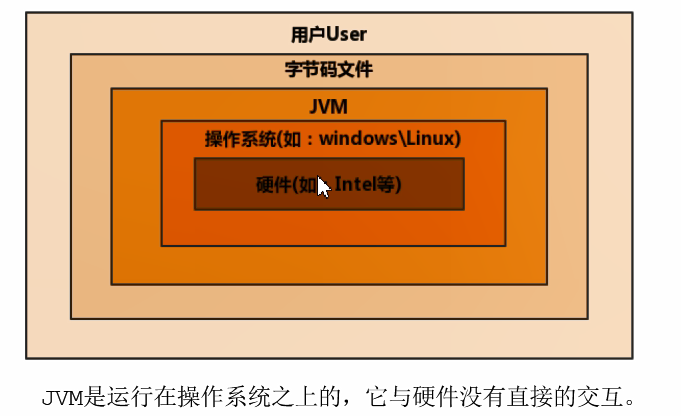
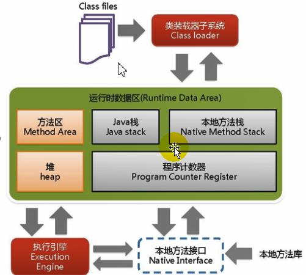
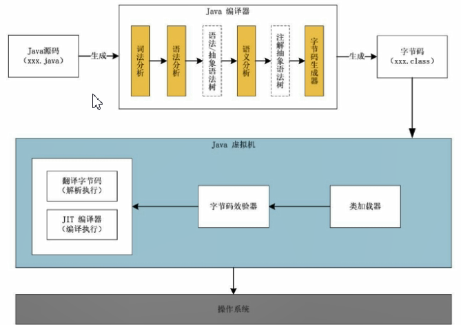
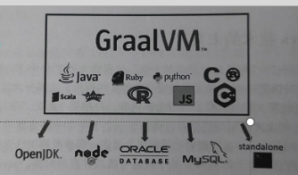

## 字节码

- 我们平时说的java字节码，指的是用java语言编译成的字节码。准确的说任何能在jvm平台上执行的字节码格式都是一样的。所以应该统称为：**jvm字节码**。


- 不同的编译器，可以编译出相同的字节码文件，字节码文件也可以在不同的JVM上运行。


- Java虚拟机与Java语言并没有必然的联系，它只与特定的二进制文件格式—Class文件格式所关联，Class文件中包含了Java虚拟机指令集(或者称为字节码、Bytecodes)和符号表，还有一些其他辅助信息。Java虚拟机与Java语言并没有必然的联系，它只与特定的二进制文件格式—Class文件格式所关联，Class文件中包含了Java虚拟机指令集(或者称为字节码、Bytecodes)和符号表，还有一些其他辅助信息。

## 多语言混合编程

​	Java平台上的多语言混合编程正成为主流，通过特定领域的语言去解决特定领域的问题是当前软件开发应对日趋复杂的项目需求的一个方向。

​	试想一下，在一个项目之中，并行处理用c1ojure语言编写，展示层使用JRuby/Rails，中间层则是Java，每个应用层都将使用不同的编程语言来完成，而且，接口对每一层的开发者都是透明的，各种语言之间的交互不存在任何困难，就像使用自己语言的原生API一样方便，因为它们最终都运行在一个虚拟机之上。

​	对这些运行于Java虚拟机之上、Java之外的语言，来自系统级的、底层的支持正在迅速增强，以JSR-292为核心的一系列项目和功能改进(如DaVinci Machine项目、Nashorn引擎、InvokeDynamic指令、java.lang.invoke包等），推动Java虚拟机从“Jva语言的虚拟机”向“多语言虚拟机”的方向发展。	对这些运行于Java虚拟机之上、Java之外的语言，来自系统级的、底层的支持正在迅速增强，以JSR-292为核心的一系列项目和功能改进(如DaVinci Machine项目、Nashorn引擎、InvokeDynamic指令、java.lang.invoke包等），推动Java虚拟机从“Jva语言的虚拟机”向“多语言虚拟机”的方向发展。

## 虚拟机

​	所谓虚拟机(VirtualMachine)，就是一台虚拟的计算机。它是一款软件，用来执行一系列虚拟计算机指令。大体上，虚拟机可以分为**系统虚拟机**和**程序虚拟机**。

- 大名鼎鼎的Visual Box，VMware就属于系统虚拟机，它们**完全是对物理计算机的仿真**，提供了一个可运行完整操作系统的软件平台。

- 程序虚拟机的典型代表就是Java虚拟机，它**专门为执行单个计算机程序而设计**，在Java虚拟机中执行的指令我们称为Java字节码指令。·

  无论是系统虚拟机还是程序虚拟机，在上面运行的软件都被限制于虚拟机提供的资源中。


## Java虚拟机

- Java虚拟机是一台执行Java字节码的虚拟计算机，它拥有独立的运行机制，其运行的Java字节码也未必由Java语言编译而成。

- JVM平台的各种语言可以共享Java虚拟机带来的跨平台性、优秀的垃圾回器，以及可靠的即时编译器。

- Java技术的核心就是Java虚拟机(JVM，Java Virtual Machine)，因为所有的Java程序都运行在Java虚拟机内部。

  ​

  ### 作用

  ​	Java虚拟机就是二进制字节码的运行环境，负责装载字节码到其内部，解释/编译为对应平台上的机器指令执行。每一条Java指令，Java虚拟机规范中都有详细定义，如怎么取操作数，怎么处理操作数，处理结果放在哪里。

  ### 特点

  - 一次编译，到处运行
  - 自动内存管理
  - 自动垃圾回收功能



## JVM的整体结构

- HotSpotVM是目前市面上高性能虚拟机的代表作之一
- 它采用解释器与即时编译器并存的架构。
- 在今天，Java程序的运行性能早已脱胎换骨，已经达到了可以和C/C++程序一较高下的地步。




## Java代码的执行流程




## JVM的架构模型

​	Java编译器输入的指令流基本上是一种**基于栈的指令集架构**，另外一种指令集架构则是**基于寄存器的指令集架构**。

具体来说：这两种架构之间的区别：

- 基于栈式架构的特点
  - 设计和实现更简单，适用于资源受限的系统；
  - 避开了寄存器的分配难题：使用零地址指令方式分配。
  - 指令流中的指令大部分是零地址指令，其执行过程依赖于操作栈。指令集更小，编译器容易实现。
  - 不需要硬件支持，可移植性更好更好实现跨平台·

    ​

- 基于寄存器架构的特点

  - 典型的应用是x86的二进制指令集：比如传统的Pc以及Android的Davlik虚拟机。
  - 指令集架构则完全依赖硬件，可移植性差性能优秀和执行更高效；
  - 花费更少的指令去完成一项操作。
  - 在大部分情况下，基于寄存器架构的指令集往往都以一地址指令、二地址指令和三地址指令为主，而基干栈式架构的指今集却是以零地址指今为主。


### 举例1：

同样执行2+3这种逻辑操作，其指令分别如下：

基于栈的计算流程(以Java虚拟机为例)：

```java
1 inconst_2 //常量3入栈
2 istore_1
3 iconst_3 //常量3入栈
4 istore_2
5 iload_1
6 iload_2
7 iadd   //常量2、3出栈，执行相加
8 istore_e //结果s入栈
```

而基于寄存器的计算流程：

```java
1 mov eax,2//将eax寄存器的值设为1
2 add eax,3//使eax寄存器的值加3`
```

### 总结：

**由于跨平台性的设计，Java的指令都是根据栈来设计的**。不同平台CPU架构不同，所以不能设计为基于寄存器的。优点是跨平台，指令集小，编译器容易实现，缺点是性能下降，实现同样的功能需要更多的指令。

时至今日，尽管嵌入式平台已经不是Java程序的主流运行平台了(准确来说应该是HotSpotVM的宿主环境已经不局限于嵌入式平台了)，那么为什么不将架构更换为基于寄存器的架构呢?

栈：跨平台性、指令集性、指令多、执行性能比寄存器差

## JVM的生命周期

### 虚拟机的启动

​	Java虚拟机的启动是通过引导类加载器(bootstrap class loader)创建一个初始类(initialclass)来完成的，这个类是由虚拟机的具体实现指定的。

### 虚拟机的执行

- 一个运行中的Java虚拟机有着一个清晰的任务：执行Java程序。
- 程序开始执行时他才运行，程序结束时他就停止。
- **执行一个所谓的Java程序的时候，真真正正在执行的是一个叫做Java虚拟机的进程。**

### 虚拟机的退出

有如下的几种情况：

- 程序正常执行结束
- 程序在执行过程中遇到了异常或错误而异常终止
- 由于操作系统出现错误而导致Java虚拟机进程终止
- 某线程调用Runtime类或system类的exit方法，或 Runtime类的halt方法，并且Java安全管理器也允许这次exit或halt操作。
- 除此之外，JNI(Java Native Interface)规范描述了用JNIInvocation API来加载或卸载Java虚拟机时，Java虚拟机的退出情况

## JVM的发展历程

### Sun Classic VM

- 早在1996年Java1.0版本的时候，Sun公司发布了一款名为sunclassicVM的Java虚拟机，它同时也是**世界上第一款商用Java虚拟机**，JDK1.4时完全被淘汰。
- 这款虚拟机内部**只提供解释器**。如果使用JIT编译器，就需要进行外挂。但是一旦使用了JIT编译器，JIT就会接管虚拟机的执行系统。解释器就不再工作。
- 解释器和编译器不能配合工作。·现在hotspot内置了此虚拟机。

### Exact VM

- 为了解决上一个虚拟机问题，jdk1.2时，sun提供了此虚拟机。
- Exact Memory Management：准确式内存管理
  - 也可以叫Non-Conservative/Accurate Memory Management
  - 虚拟机可以知道内存中某个位置的数据具体是什么类型。


- 具备现代高性能虚拟机的雏形
  - 热点探测
  - 编译器与解释器混合工作模式


- 只在solaris平台短暂使用，其他平台上还是classicvm
  - 英雄气短，终被Hotspot虚拟机替换

### SUN公司的 HotSpot VM

- HotSpot历史
  - 最初由一家名为“Longview Technologies”的小公司设计
  - 1997年，此公司被sun收购；2009年，Sun公司被甲骨文收购。
  - JDK1.3时，HotSpotVM成为默认虚拟机


- 目前Hotspot占有绝对的市场地位，称霸武林。
  - 不管是现在仍在广泛使用的JDK6，还是使用比例较多的JDK8中，默认的虚拟机都是HotSpot
  - Sun/Oracle JDK和OpenJDK的默认虚拟机
  - 因此本课程中默认介绍的虚拟机都是HotSpot，相关机制也主要是指HotSpot的GC机制。(比如其他两个商用虚拟机都没有方法区的概念)
- 从服务器、桌面到移动端、嵌入式都有应用。
- 名称中的HotSpot指的就是它的热点代码探测技术。
  - 通过计数器找到最具编译价值代码，触发即时编译或栈上替换
  - 通过编译器与解释器协同工作，在最优化的程序响应时间与最佳执行性能中取得平衡通过编译器与解释器协同工作，在最优化的程序响应时间与最佳执行性能中取得平衡

## BEA 的 JRockit

- 专注于服务器端应用
  - 它可以不太关注程序启动速度，因此JRockit内部不包含解析器实现，全部代码都靠即时编译器编译后执行。
- 大量的行业基准测试显示，JRockitJVM是世界上最快的JVM。
  - 使用JRockit产品，客户已经体验到了显著的性能提高（一些超过了70)和硬件成本的减少（达50%)。A
- 优势：全面的Java运行时解决方案组合>JRockit面向延迟敏感型应用的解决方案
  - JRockitRealTime提供以毫秒或微秒级的JVM响应时间，适合财务、军事指挥、电信网络的需要
  - MissionContro1服务套件，它是一组以极低的开销来监控、管理和分析生产环境中的应用程序的工具。
- 2008年，BEA被Oracle收购。
- Oracle表达了整合两大优秀虚拟机的工作，大致在JDK8中完成。整合的方式是在HotSpot的基础上，移植JRockit的优秀特性。
- 高斯林：目前就职于谷歌，研究人工智能和水下机器人

### IBM 的 J9

- 全称：IBMTechnologyforJavaVirtualMachine，简称IT4J，内部代号：J9
- 市场定位与HotSpot接近，服务器端、桌面应用、嵌入式等多用途VM
- 广泛用于IBM的各种Java产品。
- 目前，有影响力的太商用虚拟机之一，也号称是世界上最快的Java虚拟机。
- 2017年左右，IBM发布了开源J9VM，命名为OpenJ9，交给Eclipse基金会管理，也称为Eclipse OpenJ9

### Azul VM
- 前面三大“高性能Java虚拟机”使用在通用硬件平台上
- 这里AzulVM和BEALiquidVM是与特定硬件平台绑定、软硬件配合的专有
  虚拟机
    - 高性能Java虚拟机中的战斗机。
- AzulVM是Azul Systems公司在HotSpot基础上进行大量改进，运行于
- Azul Systems公司的专有硬件vega系统上的Java虚拟机。
- 每个Azu1VM实例都可以管理至少数十个CPU和数百GB内存的硬件资源，并
  提供在巨大内存范围内实现可控的GC时间的垃圾收集器、专有硬件优化的线
  程调度等优秀特性。
- 2010年，AzulSystems公司开始从硬件转向软件，发布了自己的zing
  JVM，可以在通用x86平台上提供接近于vega系统的特性。

### Liquid VM
- 高性能Java虚拟机中的战斗机。
- BEA公司开发的，直接运行在自家Hypervisor系统上
- Liquid VM即是现在的JFlockit VE(VirtualEdition)，Liquido
  VM**不需要操作系统的支持，或者说它自己本身实现了一个专用操作系统**
  **的必要功能，如线程调度、文件系统、网络支持等。**
- 随着JRockit虚拟机终止开发，LiquidVM项目也停止了。


### Apache Harmony

- Apace也曾经推出过与JDK1.5和JDK1.6兼容的Java运行平台
  Apache Harmony。
- 它是IBM和Intel联合开发的开源JVM，受到同样开源的OpenJDK的压制，
  Sun坚决不让Harmony获得JCP认证，最终于2011年退役，IBM转而参与
  OpenJDK
- 虽然目前并没有Apache Harmony被大规模商用的案例，但是它的Java
  类库代码吸纳进了Android SDK。
- JCP 

### Microsoft JVM
- 微软为了在IE3浏览器中支持Java Applets，开发了MicrosoftJVM。
- 只能在window平台下运行。但确是当时windows下性能最好的JavaVM。
- 1997年，Sun以侵犯商标、不正当竞争罪名指控微软成功，赔了sun很多
  钱。微软在windowsXP sP3中抹掉了具M。现在windows上安装的jdk
  都是HotSpot。

### TaobaoJVM
- 由A1iJVM团队发布。阿里，国内使用Java最强大的公司，覆盖云计算、金融、物流、
  电商等众多领域，需要解决高并发、高可用、分布式的复合问题。有大量的开源产品。
- **基于OpenJDK开发了自己的定制版本AlibabaJDK**，简称AJDK。是整个阿里Java体
  系的基石。
- 基于OpenJDK HotSpotVM发布的国内第一个优化、**深度定制且开源的高性能服务器**
  版Java虚拟机。
  - 创新的GcIH(Gc invisible heap)技术实现了off-heap，**即将生命周期
    较长的Java对象从heap中移到heap之外，并且Gc不能管理GcIH内部的Java 对o
    象，以此达到降低GC的回收频率和提升GC的回收效率的目的。**
  - GCIH中的对象]还能够在**多个Java虚拟机进程中实现共享**
  - 使用crc32指令实现JVMintrinsic降低JNI的调用开销
  - PMU hardware的Java profilingtool和诊断协助功能
  - 针对大数据场景的ZenGC
- taobaovm应用在阿里产品上性能高，硬件严重依赖intel的cpu，损失了兼容性，但
  提高了性能
  - 目前已经在淘宝、天猫上线，把oracle官方JVM版本全部替换了。

### Dalvik VM:
- 谷歌开发的，应用于Android系统，并在Android2.2中提供了JIT，发展迅猛。
- DalvikVM只能称作虚拟机，而不能称作“Java虚拟机”，它没有遵循Java
  虚拟机规范
- 不能直接执行Java的class文件
- 基于寄存器架构，不是jvm的栈架构。
- 执行的是编译以后的dex(DalvikExecutable)文件。执行效率比较高。
  - 它执行的dex(DalvikExecutable)文件可以通过class文件转化而来，
    使用Java语法编写应用程序，可以直接使用大部分的Java API等。
- Android5.0使用支持提前编译(Ahead ofTime Compilation，AoT)的
  ART VM替换Dalvik VM。

### Graal VM

- 2018年4月，Oracle Labs公开了Graal VM，号称
  "Run Programs Faster Anywhere"，勃勃野心。
  与1995年java的”write once,run anywhere"遥相呼应。
- GraalVM在HotSpotVM基础上增强而成的跨语言全栈虚拟机，可以作为“任何语言”
  的运行平台使用。语言包括：Java、Scala、Groovy、Kotlin；c、C++、
  JavaScript、Ruby、Python、R等
- 支持不同语言中混用对方的接口和对象，支持这些语言使用已经编写好的本地库文件
- 工作原理是将这些语言的源代码或源代码编译后的中间格式，通过解释器转换为能被
  GraalVM接受的中间表示。GraalVM提供Truffle工具集快速构建面向一种新语
  言的解释器。在运行时还能进行即时编译优化，获得比原生编译器更优秀的执行效率。
- 如果说HotSpot有一天真的被取代，Graal VM希望最大。但是Java的软件生态没有
  丝毫变化。





