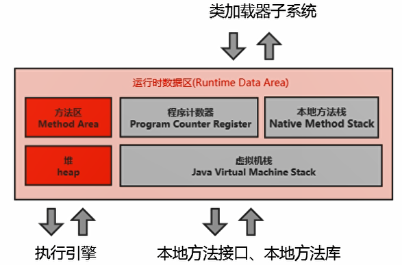
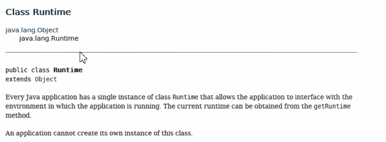

  内存是非常重要的系统资源，是硬盘和CPU的中间仓库及桥梁，承载着操作系统和应用程序的实时运行。JVM内存布局规定了Java在运
行过程中内存申请、分配、管理的策略I保证了JVM的高效稳定运行。
**不同的JVM对于内呼的划分方式和管理机制存在着部分差异**。结合JVM
虚拟机规范，来探讨一下经典的JVM内存布局。

Java虚拟机定义了若干种程序运行期间会使用到的运行时数据区，其中有一些会随着
虚拟机启动而创建，T随着虚拟机退出而销毁。另外一些则是与线程一一对应的，这些
与线程对应的数据区域会随着线程开始和结束而创建和销毁。
灰色的为单独线程私有的，红色的为多个线程共享的。即：
- 每个线程：独立包括程序计数器、栈、本地栈。
- 线程间共享：堆、堆外内存（永久代或元空间、代码缓存）

## 关于线程间共享的说明

每个JVM只有一个Runtime实例。即为运行时环境。

## 线程

- 线程是一个程序里的运行单元。JVM允许一个应用有多个线程并行的执行。

- 在HotspotJVM里，每个线程都与操作系统的本地线程直接映射。

  - 当一个Java线程准备好执行以后，此时一个操作系统的本地线程也同时创建。Java线程执行终止后，本地线程也会回收。

- 操作系统负责所有线程的安排调度到任何一个可用的CPU上。一旦本地线程初始化成功，它就会调用Java线程中的run()方法。

### JVM系统线程

- 如果你使用jconsole或者是任何一个调试工具，都能看到在后台有许多线程在运行。这些后台线程不包括调用public static void main(string[])的main线程以及所有这个main线程自己创建的线程。
- 这些主要的后台系统线程在HotspotJVM里主要是以下几个：
  - **虚以机线程：**这种线程的操作是需要JVM达到安全点才会出现。这些操作必须在不同的线程中发生的原因是他们都需要JVM达到安全点，这样堆才不公变化。这种线程的执行类型包括”stop-the-world”的垃圾收集，线程栈收集，线程挂起以及偏向锁撤销。
  - **周期任务线程：**这种线程是时间周期事件的体现(比如中断)，他们一般用于周期性操作的调度执行。
  - **GC线程：**这种线程对在JVM里不同种类的垃圾收集行为提供了支持。
  - **编译线程：**这种线程在运行时会将字节码编译成到本地代码。信号调度线程：这种线程接收信号并发送给JVM，在它内部通过调用适当的方法进行处理。

