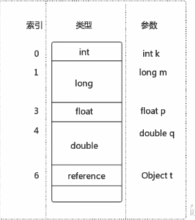
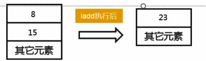
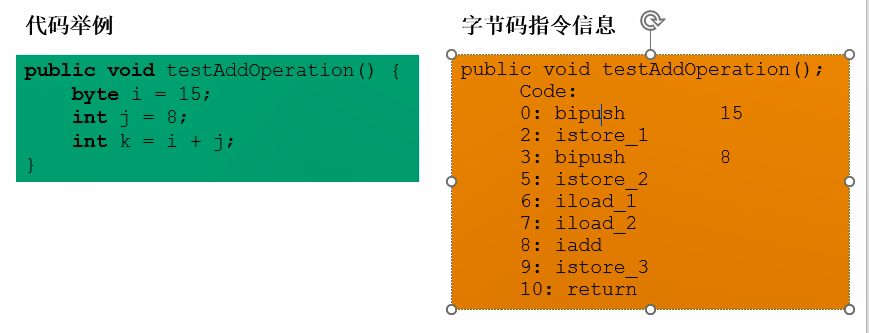

## 虚拟机栈的基本内容

### 虚拟机栈出现的背景

​	由于跨平台性的设计，Java的指令都是根据栈来设计的。不同平台CPU架构不同，所以不能设计为基于寄存器的。**优点是跨平台，指令集小，译器容易实现，缺点是性能下降，实现同样的功能需要更多的指令。**

### 内存中度过堆和栈

**栈是运行时的单位，而堆是存储的单位。**即：栈解决程序的运行问题，即程序如何执行，或者说如何处理数据。堆解决的是数据存储的问题，即数据怎么放、放在哪儿。

#### Java虚拟机栈是什么?

Java虚拟机栈(Java Virtual Machine Stack)，早期也叫Java栈。每个线程在创建时都会创建一个虚拟机栈，其内部保存一个个的栈帧(StackFrame)，对应着一次次的Java方法调用。

- 是线程私有的

#### 生命周期

​	生命周期和线程一致。

#### 作用

​	主管Java程序的运行，它保存方法的局部变量（八种基本变量，对象引用地址）、部分结果，并参与方法的调用和返回。

- 局部变量 vs成员变量
- 基本数据变量 vs引用类型变量

### 栈的特点

 

- 栈是一种快速有效的分配存储方式，访问速度仅次于程序计数器。
  - JVM直接对Java栈的操作只有两个：

  - 每个方法执行，伴随着进栈(入栈、压栈)执行结束后的出栈工作
 - 对于栈来说不存在垃圾回收问题
   - 不存在GC；内存超了就OOM


## 栈的存储单位和运行原理

### 栈中存储什么？

- 每个线程都有自己的栈，栈中的数据都是以**栈帧（StackFrame)的格式存在**。
- 在这个线程上正在执行的每个方法都各自对应一个栈帧(StackFrame)。
- 栈帧是一个内存区块，是一个数据集，维系着方法执行过程中的各种数据信息。

### 栈运行原理

- JVM直接对Java栈的操作只有两个，就是对栈帧的**压栈**和**出栈**，遵循“先进后出”/“后进先出”原则。
- 在一条活动线程中，一个时间点上，只会有一个活动的栈帧。即只有当前正在执行的方法的栈帧(栈顶栈帧）是有效的，这个栈帧被称为当前栈帧(Current Frame)，与当前栈帧相对应的方法就是当前方法(CurrentMethod)，定义这个方法的类就是当前类(Currentclass)。
- 执行引擎运行的所有字节码指令只针对当前栈帧进行操作。
- 如果在该方法中调用了其他方法，对应的新的栈帧会被创建出来，放在栈的顶端，成为新的当前帧。


- 不同线程守所包含的栈帧是不允许存在相互引用的，即不可能在一个栈帧之中引用另外一个线程的栈帧。
- 如果当前方法调用了其他方法，方法返回之际，当前栈帧会传回此方法的执行结果给前一个栈帧，接着，虚拟机会丢弃当前栈帧，使得前一个栈帧重新成为当前栈帧。
- Java方法有两种返回函数的方式，**一种是正常的函数返回，使用return指令；另外一种是抛出异常。不管使用哪种方式，都会导致栈帧被弹出。**


## 栈帧的内部结构


### 局部变量表（Local variables）

- 局部变量表也被称之为局部变量数组或本地变量表
- **定义为一个数字数组，主要用于存储方法参数和定义在方法体内的局部变量**，这些数据类型包括各类基本数据类型、对象引用(reference)，以及returnAddress类型。
- 由于局部变量表是建立在线程的栈上，是线程的私有数据，因此**不存在数据安全问题**
- 局部变量表所需的容量大小是在编译期确定下来的，并保存在方法的code属性的maximum local variables数据项中。在方法运行期间是不会改变局部变量表的大小的。
- **方法嵌套调用的次数由栈的大小决定**。一般来说，**栈越大，方法嵌套调用次数越多**。对一个函数而言，它的参数和局部变量越多，使得局部变量表膨胀，它的栈帧就越大，以满足方法调用所需传递的信息增大的需求。进而函数调用就会占用更多的栈空间，导致其嵌套调用次数就会减少。
- **局部变量表中的变量只在当前方法调用中有效**。在方法执行时，虚拟机通过使用局部变量表完成参数值到参数变量列表的传递过程。**当方法调用结束后，随着方法栈帧的销毁，局部变量表也会随之销毁。**


### 关于slot的理解

- 参数值的存放总是在局部变量数组的index0开始，到数组长度-1的索引结束。
- 局部变量表，最基本的存储单元是S1ot(变量槽)
- 局部变量表中存放编译期可知的各种基本数据类型(8种），引用类型(reference)，returnAddress类型的变量。
- 在局部变量表里，32位以内的类型只占用一个slot（包括returnAddress类型)，64位的类型(long和double)占用两个slot。
  - byte、short、char在存储前被转换为int，boolean也被转换为int，0表示false，非o表示true。
  - long 和double则占据两个slot。
- JVM会为局部变量表中的每一个s1ot都分配一个访问索引，通过这个索引即可成功访问到局部变量表中指定的局部变量值
- 当一个实例方法被调用的时候，它的方法参数和方法体内部定义的局部变量将会**按照顺序被复制**到局部变量表中的每一个slot上
- **如果需要访问局部变量表中一个64bit的局部变量值时，只需要使用前一个索引即可**。(比如：访问1ong或double类型变量)
- 如果当前帧是由构造方法或者实例方法创建的，那么**该对象引用this将会存放在index为o的s1ot处**，其余的参数按照参数表顺序继续排列。




- 栈帧中的局部变量表中的槽位是可以重用的，如果一个局部变量过了其作用域，那么在其作用域之后申明的新的局部变量就很有可能会复用过期局部变量的槽位，从而达到节省资源的目的。

  ```java
  public class SlotTest {
    publirs void localVarl(){
      int a =0;
      System.out.println(a);
      int b =0;
    }
      
      public void localVar2(){
        {
          int a =0;
          System.out.println(a);
      	}
        //此时的b就会复用a的槽位
        int b=0;11}
  	}                                                                         
  }
  ```

  ###  举例：静态变量与局部变量的对比

- 参数表分配完毕之后，再根据方法体内定义的变量的顺序和作用域分配。

- 我们知道类变量表有两次初始化的机会，第一次是在“准备阶段”，执行系统初始化，对类变量设置零值，另一次则是在“初始化”阶段，赋予程序员在代码中定义的初始值。

- 和类变量初始化不同的是，局部变量表不存在系统初始化的过程，这意味着一旦定义了局部变量则必须人为的初始化，否则无法使用。

  ```java
   public void test(){
     int i;
     System.out.println(i);
   }
  ```

  ​

- 这样的代码是错误的，没有赋值不能够使用。

#### 补充说明

- 在栈帧中，与性能调优关系最为密切的部分就是前面提到的局部变量表。在方法执行时，虚拟机使用局部变量表完成方法的传递。
- **局部变量表中的变量也是重要的垃圾回收根节点，只要被局部变量表中直接或间接引用的对象都不会被回收。**

##操作数栈

- 每一个独立的栈帧中除了包含局部变量表以外，还包含一个后进先出（Last-In-First-Out)的操作数栈，也可以称之为表达式栈(Expression Stack)。
- 操作数栈，在方法执行过程中，根据字节码指令，往栈中写入数据或提取数据，即入栈(push)/出栈(pop)。
  - 某些字节码指令将值压入操作数栈，其余的字节码指令将操作数取出栈。使用它们后再把结果压入栈。

  - 比如：执行复制、交换、求和等操作

    

 

- 操作数栈，主要用于保存计算过程的中间结果，同时作为计算过程中变量临时的存储空间。
- 操作数栈就是JVM执行引擎的一个工作区，当一个方法刚开始执行的时候，一个新的栈帧也会随之被创建出来，**这个方法的操作数栈是空的**。
- 每一个操作数栈都会拥有一个明确的栈深度用于存储数值，其所需的最大深度在编译担就定义好了，保存在方法的code属性中，为max stack的值。
- 栈中的任何一个元素都是可以任意的Java数据类型。

  - 32bit的类型占用一个栈单位深度

  - 64bit的类型占用两个栈单位深度
 - 操作数栈**并非采用访问索引的方式来进行数据访问**的，而是只能通过标准的入栈(push)和出栈(pop)操作来完成一次数据访问。
 - 如果被调用的方法带有返回值的话，其返回值将会被压入当前栈帧的操作数栈中，并更新PC寄存器中下一条需要执行的字节码指令。
 - 操作数栈中元素的数据类型必须与字节码指令的序列严格匹配，这由编译器在编译器期间进行验证，同时在类加载过程中的类检验阶段的数据流分析阶段要再次验证。
 - 另外，我们说Java虚拟机的解释引擎是基于栈的执行引擎，其中的栈指的就是操作数栈。


## 栈顶缓存(Top-of-StackCashing)技术

前面提过，基于栈式架构的虚拟机所使用的零地址指令更加紧凑，但完成一项操作的时候必然需要使用更多的入栈和出栈指令，这同时也就意味着将需要更多的指令分派(instruction dispatch)次数和内存读/写次数。

由于操作数是存储在内存中的，因此频繁地执行内存读/写操作必然会影响执很速度。为了解决这个问题，HotSpotJVM的设计者们提出了栈顶缓存r(Tos，Top-of-stack Cashing)技术，**将栈顶元素全部缓存在物理CPU的寄存器中，以此降低对内存的读/写次数，提升执行引擎的执行效率。**

## 动态链接

- 每一个栈帧内部都包含一个指向运行时常量池中该栈帧所属方法的引用。包含这个引用的目的就是为了支持当前方法的代码能够实现动态链接(Dynamic Linking)。比如：invokedynamic指令
- 在Java源文件被编译到字节码文件中时，所有的变量和方法引用都作为符号引用(Symbolic Reference)保存在class文件的常量池里。比如：描述一个方法调用了另外的其他方法时，就是通过常量池中指向方法的符号引用来表示的，那么动态链接的作用就是为了将这些符号引用转换为调用方法的直接引用。

## 方法的调用

对应的方法的绑定机制为：早期绑定(Early Binding)和晚期绑定(Late Binding)。**绑定是一个字段、方法或者类在符号引用被替换为直接引用的过程，这仅仅发生一次**。

- **早期绑定：**早期绑定就是指被调用的目标方法如果在编译期可知，且运行期保持不变时，即可将这个方法与所属的类型进行绑定，这样一来，由于明确了被调用的目标方法究竟是哪一个，因此也就可以使用静态链接的方式将符号引用转换为直接引用。
- **晚期绑定：**如果被调用的方法在编译期无法被确定下来，只能够在程序运行期根据实际的类型绑定相关的方法，这种绑定方式也就被称之为晚期绑定。

随着高级语言的横空出世，类似于Java一样的基于面向对象的编程语言如今越来越多，尽管这类编程语言在语法风格上存在一定的差别，但是它们彼此之间始终保持着一个共性，那就是都支持封装、继承和多态等面向对象特性，既然**这一类的编程语言具备多态特性，那么自然也就具备早期绑定和晚期绑定两种绑定方式。**

Java中任何一个普通的方法其实都具备虚函数的特征，它们相当于c++语言中的虚函数(C++中则需要使用关键字virtual来显式定义)。如果在Java程序中不希望某个方法拥有虚函数的特征时，则可以使用关键字final来标记这个方法。

### 虚方法和非虚方法

- 果方法在编译期就确定了具体的调用版本，这个版本在运行时是不可变的。这样的方法称为**非虚方法**。
- 静态方法、私有方法、final方法、实例构造器、父类方法都是非虚方法。
- 其他方法称为**虚方法**。


虚拟机中提供了以下几条方法调用指令：

- 普通调用指令：

  1.invokestatic：调用静态方法，解析阶段确定唯一方法版本

  2.invokespecial：调用<init>方法、私有及父类方法，解析阶段确定唯一方法版本3.invokevirtual：调用所有虚方法

  4.invokeinterface：调用接口方法动态调用指令：

  5.invokedynamic：动态解析出需要调用的方法，然后执行

 - 前四条指令固化在虚拟机内部，方法的调用执行不可人为干预，而invokedynamic指令则支持由用户确定方法版本。其中invokestatic指令和invokespecial指令调用的方法称为非虚方法，其余的（final修饰的除外)称为虚方法。


### 关于invokeddynamic

- JVM字节码指令集一直比较稳定，一直到Java7中才增加了一个invokedynamic指令，这是Java为了实现『动态类型语言』支持而做的一种改进。
- 但是在Java7中没有提供直接生成invokedynamic指令的方法，需要借助ASM这种底层字节码工具来产生invokedynamic指令。直到Java8的Lambda表达式的出现，invokedynamic指令的生成，在Java中才有了直接的生成方式。
- Java7中增加的动态语言类型支持的本质是对Java虚拟机规范的修改，而不是对Java语言规则的修改，这一块相对来讲比较复杂，增加了虚拟机中的方法调用，最直接的受益者就是运行在Java平台的动态语言的编译器。

### 动态类型语言和静态类型语言

动态类型语言和静态类型语言两者的区别就在于对类型的检查是在编译期还是在运行期，卜满足前者就是静态类型语言，反之是动态类型语言。

说的再直白一点就是，静态类型语言是判断变量自身的类型信息；动态类型语言是判断变量值的类型信息，变量没有类型信息，变量值才有类型信息，这是动态语言的一个重要特征。


### 方法的调用：方法重写的本质

Java语言中方法重写的本质：

1. 找到操作数栈顶的第一个元素所执行的对象的实际类型，记作

2. 如果在类型C中找到与常量中的描述符合简单名称都相符的方法，则进行访问权限校验，如果通过则返回这个方法的直接引用，查找过程结束；如果不通过，则返回java.lang.IllegalAccessError 异常。

3. 否则，按照继承关系从下往上依次对c的各个父类进行第2步的搜索和验证过程。O4.如果始终没有找到合适的方法，则抛出java.lang.AbstractMethodError异常。

   ​

   **IllegalAccessError介绍：**

   程序试图访问或修改一个属性或调用一个方法，这个属性或方法，你没有权限访问。一般的，这个会引起编译器异常。这个错误如果发生在运行时，就说明一个类发生了不兼容的改变。

## 方法返回地址

- 存放调用该方法的pc寄存器的值。
- 一个方法的结束，有两种方式：
  - 正常执行完成
  - 出现未处理的异常，非正常退出
- 无论通过哪种方式退出，在方法退出后都返回到该方法被调用的位置。方法正常退出时，**调用者的pc计数器的值作为返回地址，即调用该方法的指令的下一条指令的地址**。而通过异常退出的，返回地址是要通过异常表来确定，栈帧中一般不会保存这部分信息。


当一个方法开始执行后，只有两种方式可以退出这个方法：

1. 执行引擎遇到任意一个方法返回的字节码指令(return)，会有返回值传递给上层的方法调用者，简称**正常完成出口**；

   - 一个方法在正常调用完成之后究竟需要使用哪一个返回指令还需要根据方法返回值的实际数据类型而定。
   - 在字节码指令中，返回指令包含ireturn(当返回值是boolean、byte、char、short和int类型时使用)、lretur freturn、dreturn以及areturn，另外还有一个return指令供声明为void的方法、实例初始化方法、类和接口的初始化方法使用。

2. 在方执行的过程中遇到了异常（Excleption)，并且这个异常没有在方法内进行处理，也就是只要在本方法的异常表中没有搜索到匹配的异常处理器，就会导致方法退出。简称**异常完成出口。**

   方法执行过程中抛出异常时的异常处理，存储在一个异常处理表，方便在发生异常的时候找到处理异常的代码。


本质上，方法的退出就是当前栈帧出栈的过程。此时，需要恢复上层方法的局部变量表、操作数栈、将返回值压入调用者栈帧的操作数栈、设置PC寄存器值等，让调用者方法继续执行下去。**正常完成出口和异常完成出口的区别在于：通过异常完成出口退出的不会给他的上层调用者产生任何的返回值。**

## 一些附加信息

栈帧中还允许携带与Java虚拟机实现相关的一些附加信息。例如，对程序调试提供支持的信息。


