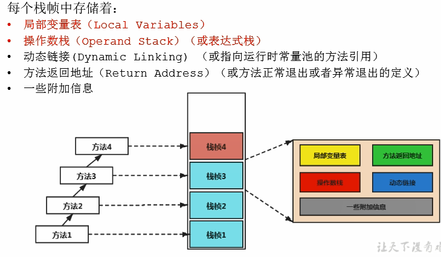

## 虚拟机栈的基本内容

### 虚拟机栈出现的背景

​	由于跨平台性的设计，Java的指令都是根据栈来设计的。不同平台CPU架构不同，所以不能设计为基于寄存器的。**优点是跨平台，指令集小，译器容易实现，缺点是性能下降，实现同样的功能需要更多的指令。**

### 内存中度过堆和栈

**栈是运行时的单位，而堆是存储的单位。**即：栈解决程序的运行问题，即程序如何执行，或者说如何处理数据。堆解决的是数据存储的问题，即数据怎么放、放在哪儿。

#### Java虚拟机栈是什么?

Java虚拟机栈(Java Virtual Machine Stack)，早期也叫Java栈。每个线程在创建时都会创建一个虚拟机栈，其内部保存一个个的栈帧(StackFrame)，对应着一次次的Java方法调用。

- 是线程私有的

#### 生命周期

​	生命周期和线程一致。

#### 作用

​	主管Java程序的运行，它保存方法的局部变量（八种基本变量，对象引用地址）、部分结果，并参与方法的调用和返回。

- 局部变量 vs成员变量
- 基本数据变量 vs引用类型变量

### 栈的特点

 

- 栈是一种快速有效的分配存储方式，访问速度仅次于程序计数器。
  - JVM直接对Java栈的操作只有两个：

  - 每个方法执行，伴随着进栈(入栈、压栈)执行结束后的出栈工作
 - 对于栈来说不存在垃圾回收问题
   - 不存在GC；内存超了就OOM


## 栈的存储单位和运行原理

### 栈中存储什么？

- 每个线程都有自己的栈，栈中的数据都是以**栈帧（StackFrame)的格式存在**。
- 在这个线程上正在执行的每个方法都各自对应一个栈帧(StackFrame)。
- 栈帧是一个内存区块，是一个数据集，维系着方法执行过程中的各种数据信息。

### 栈运行原理

- JVM直接对Java栈的操作只有两个，就是对栈帧的**压栈**和**出栈**，遵循“先进后出”/“后进先出”原则。
- 在一条活动线程中，一个时间点上，只会有一个活动的栈帧。即只有当前正在执行的方法的栈帧(栈顶栈帧）是有效的，这个栈帧被称为当前栈帧(Current Frame)，与当前栈帧相对应的方法就是当前方法(CurrentMethod)，定义这个方法的类就是当前类(Currentclass)。
- 执行引擎运行的所有字节码指令只针对当前栈帧进行操作。
- 如果在该方法中调用了其他方法，对应的新的栈帧会被创建出来，放在栈的顶端，成为新的当前帧。


- 不同线程守所包含的栈帧是不允许存在相互引用的，即不可能在一个栈帧之中引用另外一个线程的栈帧。
- 如果当前方法调用了其他方法，方法返回之际，当前栈帧会传回此方法的执行结果给前一个栈帧，接着，虚拟机会丢弃当前栈帧，使得前一个栈帧重新成为当前栈帧。
- Java方法有两种返回函数的方式，**一种是正常的函数返回，使用return指令；另外一种是抛出异常。不管使用哪种方式，都会导致栈帧被弹出。**


## 栈帧的内部结构



### 局部变量表（Local variables）

- 局部变量表也被称之为局部变量数组或本地变量表
- **定义为一个数字数组，主要用于存储方法参数和定义在方法体内的局部变量**，这些数据类型包括各类基本数据类型、对象引用(reference)，以及returnAddress类型。
- 由于局部变量表是建立在线程的栈上，是线程的私有数据，因此**不存在数据安全问题**
- 局部变量表所需的容量大小是在编译期确定下来的，并保存在方法的code属性的maximum local variables数据项中。在方法运行期间是不会改变局部变量表的大小的。
- **方法嵌套调用的次数由栈的大小决定**。一般来说，**栈越大，方法嵌套调用次数越多**。对一个函数而言，它的参数和局部变量越多，使得局部变量表膨胀，它的栈帧就越大，以满足方法调用所需传递的信息增大的需求。进而函数调用就会占用更多的栈空间，导致其嵌套调用次数就会减少。
- **局部变量表中的变量只在当前方法调用中有效**。在方法执行时，虚拟机通过使用局部变量表完成参数值到参数变量列表的传递过程。**当方法调用结束后，随着方法栈帧的销毁，局部变量表也会随之销毁。**


### 关于slot的理解

- 参数值的存放总是在局部变量数组的index0开始，到数组长度-1的索引结束。
- 局部变量表，最基本的存储单元是S1ot(变量槽)
- 局部变量表中存放编译期可知的各种基本数据类型(8种），引用类型(reference)，returnAddress类型的变量。
- 在局部变量表里，32位以内的类型只占用一个slot（包括returnAddress类型)，64位的类型(long和double)占用两个slot。
  - byte、short、char在存储前被转换为int，boolean也被转换为int，0表示false，非o表示true。
  - long 和double则占据两个slot。
- JVM会为局部变量表中的每一个s1ot都分配一个访问索引，通过这个索引即可成功访问到局部变量表中指定的局部变量值
- 当一个实例方法被调用的时候，它的方法参数和方法体内部定义的局部变量将会**按照顺序被复制**到局部变量表中的每一个slot上
- **如果需要访问局部变量表中一个64bit的局部变量值时，只需要使用前一个索引即可**。(比如：访问1ong或double类型变量)
- 如果当前帧是由构造方法或者实例方法创建的，那么**该对象引用this将会存放在index为o的s1ot处**，其余的参数按照参数表顺序继续排列。


- 栈帧中的局部变量表中的槽位是可以重用的，如果一个局部变量过了其作用域，那么在其作用域之后申明的新的局部变量就很有可能会复用过期局部变量的槽位，从而达到节省资源的目的。

  ```java
  public class SlotTest {
    publirs void localVarl(){
      int a =0;
      System.out.println(a);
      int b =0;
    }
      
      public void localVar2(){
        {
          int a =0;
          System.out.println(a);
      	}
        //此时的b就会复用a的槽位
        int b=0;11}
  	}                                                                         
  }
  ```

  ​

