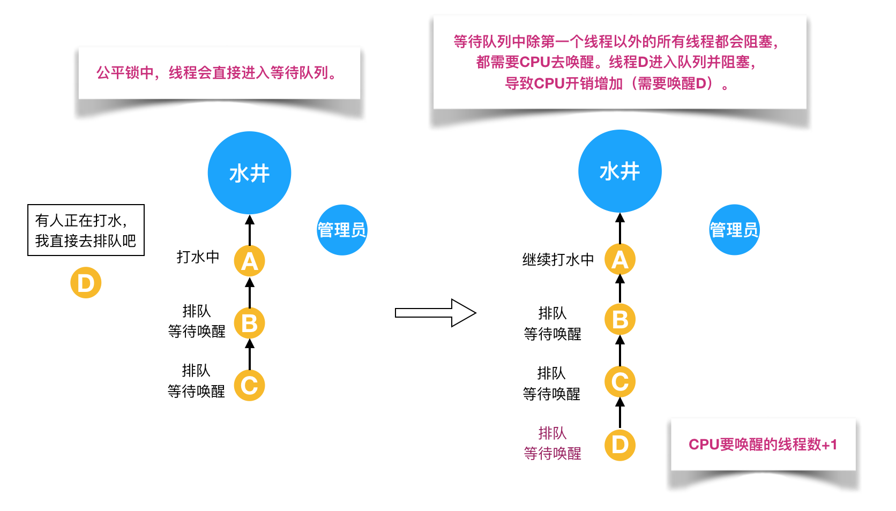

Java提供了种类丰富的锁，每种锁因其特性的不同，在适当的场景下能够展现出非常高的效率


## 乐观锁 VS 悲观锁

对于同一个数据的并发操作，**悲观锁**认为自己在使用数据的时候一定有别的线程来修改数据，因此在获取数据的时候会先加锁，确保数据不会被别的线程修改。Java中，`synchronized`关键字和`Lock的实现类`都是悲观锁。

而**乐观锁**认为自己在使用数据时不会有别的线程修改数据，所以不会添加锁，只是在更新数据的时候去判断之前有没有别的线程更新了这个数据。
如果这个数据没有被更新，当前线程将自己修改的数据成功写入。如果数据已经被其他线程更新，则根据不同的实现方式执行不同的操作（例如报错或者自动重试）。

乐观锁在Java中是通过使用无锁编程来实现，最常采用的是CAS算法，`Java原子类`中的递增操作就通过CAS自旋实现的。


+ 悲观锁适合写操作多的场景，先加锁可以保证写操作时数据正确。
+ 乐观锁适合读操作多的场景，不加锁的特点能够使其读操作的性能大幅提升。

悲观锁基本都是在显式的锁定之后再操作同步资源，而乐观锁则直接去操作同步资源。

### 乐观锁的主要实现方式 “CAS” 的技术原理

为何乐观锁能够做到不锁定同步资源也可以正确的实现线程同步呢？乐观锁主要实现了`CAS`技术，java.util.concurrent包中的原子类就是通过CAS来实现了乐观锁。

!> CAS全称 Compare And Swap（比较与交换），是一种无锁算法。在不使用锁（没有线程被阻塞）的情况下实现多线程之间的变量同步。

CAS算法涉及到三个操作数：

+ 需要读写的内存值 V。
+ 进行比较的值 A。
+ 要写入的新值 B。

当且仅当 V 的值等于 A 时，CAS通过原子方式用新值B来更新V的值（“比较+更新”整体是一个原子操作），否则不会执行任何操作。一般情况下，“更新”是一个不断重试的操作。

CAS虽然很高效，但是它也存在三大问题，这里也简单说一下：

1. **ABA问题**。CAS需要在操作值的时候检查内存值是否发生变化，没有发生变化才会更新内存值。但是如果内存值原来是A，后来变成了B，然后又变成了A，那么CAS进行检查时会发现值没有发生变化，但是实际上是有变化的。ABA问题的解决思路就是在变量前面添加版本号，每次变量更新的时候都把版本号加一，这样变化过程就从“A－B－A”变成了“1A－2B－3A”。
   -  JDK从1.5开始提供了AtomicStampedReference类来解决ABA问题，具体操作封装在compareAndSet()中。compareAndSet()首先检查当前引用和当前标志与预期引用和预期标志是否相等，如果都相等，则以原子方式将引用值和标志的值设置为给定的更新值。
2. **循环时间长开销大**。CAS操作如果长时间不成功，会导致其一直自旋，给CPU带来非常大的开销。
3. **只能保证一个共享变量的原子操作**。对一个共享变量执行操作时，CAS能够保证原子操作，但是对多个共享变量操作时，CAS是无法保证操作的原子性的。
   - Java从1.5开始JDK提供了AtomicReference类来保证引用对象之间的原子性，可以把多个变量放在一个对象里来进行CAS操作。

## 自旋锁 VS 适应性自旋锁

阻塞或唤醒一个Java线程需要操作系统切换CPU状态来完成，这种状态转换需要耗费处理器时间。如果同步代码块中的内容过于简单，状态转换消耗的时间有可能比用户代码执行的时间还要长。

在许多场景中，同步资源的锁定时间很短，为了这一小段时间去切换线程，线程挂起和恢复现场的花费可能会让系统得不偿失。如果物理机器有多个处理器，能够让两个或以上的线程同时并行执行，我们就可以让后面那个请求锁的线程不放弃CPU的执行时间，看看持有锁的线程是否很快就会释放锁。

而为了让当前线程“稍等一下”，我们需让当前线程进行自旋，如果在自旋完成后前面锁定同步资源的线程已经释放了锁，那么当前线程就可以不必阻塞而是直接获取同步资源，从而避免切换线程的开销。这就是自旋锁。


自旋锁本身是有缺点的，它不能代替阻塞。自旋等待虽然避免了线程切换的开销，但它要占用处理器时间。如果锁被占用的时间很短，自旋等待的效果就会非常好。反之，如果锁被占用的时间很长，那么自旋的线程只会白浪费处理器资源。所以，自旋等待的时间必须要有一定的限度，如果自旋超过了限定次数（默认是10次，可以使用-XX:PreBlockSpin来更改）没有成功获得锁，就应当挂起线程。


自旋锁在JDK1.4.2中引入，使用-XX:+UseSpinning来开启。JDK 6中变为默认开启，并且引入了自适应的自旋锁（适应性自旋锁）。

自适应意味着自旋的时间（次数）不再固定，而是由前一次在同一个锁上的自旋时间及锁的拥有者的状态来决定。如果在同一个锁对象上，自旋等待刚刚成功获得过锁，并且持有锁的线程正在运行中，那么虚拟机就会认为这次自旋也是很有可能再次成功，进而它将允许自旋等待持续相对更长的时间。如果对于某个锁，自旋很少成功获得过，那在以后尝试获取这个锁时将可能省略掉自旋过程，直接阻塞线程，避免浪费处理器资源。

在自旋锁中 另有三种常见的锁形式:TicketLock、CLHlock和MCSlock

## 无锁 VS 偏向锁 VS 轻量级锁 VS 重量级锁

[点击这里](multithreads/从偏向锁到重量级锁.md)


## 公平锁 VS 非公平锁

公平锁是指多个线程按照申请锁的顺序来获取锁，线程直接进入队列中排队，队列中的第一个线程才能获得锁。公平锁的优点是等待锁的线程不会饿死。缺点是整体吞吐效率相对非公平锁要低，等待队列中除第一个线程以外的所有线程都会阻塞，CPU唤醒阻塞线程的开销比非公平锁大。

非公平锁是多个线程加锁时直接尝试获取锁，获取不到才会到等待队列的队尾等待。但如果此时锁刚好可用，那么这个线程可以无需阻塞直接获取到锁，所以非公平锁有可能出现后申请锁的线程先获取锁的场景。非公平锁的优点是可以减少唤起线程的开销，整体的吞吐效率高，因为线程有几率不阻塞直接获得锁，CPU不必唤醒所有线程。缺点是处于等待队列中的线程可能会饿死，或者等很久才会获得锁。

直接用语言描述可能有点抽象，这里作者用从别处看到的一个例子来讲述一下公平锁和非公平锁。


如上图所示，假设有一口水井，有管理员看守，管理员有一把锁，只有拿到锁的人才能够打水，打完水要把锁还给管理员。每个过来打水的人都要管理员的允许并拿到锁之后才能去打水，如果前面有人正在打水，那么这个想要打水的人就必须排队。管理员会查看下一个要去打水的人是不是队伍里排最前面的人，如果是的话，才会给你锁让你去打水；如果你不是排第一的人，就必须去队尾排队，这就是公平锁。

但是对于非公平锁，管理员对打水的人没有要求。即使等待队伍里有排队等待的人，但如果在上一个人刚打完水把锁还给管理员而且管理员还没有允许等待队伍里下一个人去打水时，刚好来了一个插队的人，这个插队的人是可以直接从管理员那里拿到锁去打水，不需要排队，原本排队等待的人只能继续等待。如下图所示：

接下来我们通过ReentrantLock的源码来讲解公平锁和非公平锁。
 
根据代码可知，ReentrantLock里面有一个内部类Sync，Sync继承AQS（AbstractQueuedSynchronizer），添加锁和释放锁的大部分操作实际上都是在Sync中实现的。它有公平锁FairSync和非公平锁NonfairSync两个子类。ReentrantLock默认使用非公平锁，也可以通过构造器来显示的指定使用公平锁。

下面我们来看一下公平锁与非公平锁的加锁方法的源码:

通过上图中的源代码对比，我们可以明显的看出公平锁与非公平锁的lock()方法唯一的区别就在于公平锁在获取同步状态时多了一个限制条件：hasQueuedPredecessors()。
 
再进入hasQueuedPredecessors()，可以看到该方法主要做一件事情：主要是判断当前线程是否位于同步队列中的第一个。如果是则返回true，否则返回false。

综上，公平锁就是通过同步队列来实现多个线程按照申请锁的顺序来获取锁，从而实现公平的特性。非公平锁加锁时不考虑排队等待问题，直接尝试获取锁，所以存在后申请却先获得锁的情况。


## 可重入锁 VS 非可重入锁

可重入锁又名递归锁，是指在同一个线程在外层方法获取锁的时候，再进入该线程的内层方法会自动获取锁（前提锁对象得是同一个对象或者class），不会因为之前已经获取过还没释放而阻塞。Java中ReentrantLock和synchronized都是可重入锁，可重入锁的一个优点是可一定程度避免死锁。下面用示例代码来进行分析：
```java
public class Widget {
    public synchronized void doSomething() {
        System.out.println("方法1执行...");
        doOthers();
    }

    public synchronized void doOthers() {
        System.out.println("方法2执行...");
    }
}
```
在上面的代码中，类中的两个方法都是被内置锁synchronized修饰的，doSomething()方法中调用doOthers()方法。因为内置锁是可重入的，所以同一个线程在调用doOthers()时可以直接获得当前对象的锁，进入doOthers()进行操作。

如果是一个不可重入锁，那么当前线程在调用doOthers()之前需要将执行doSomething()时获取当前对象的锁释放掉，实际上该对象锁已被当前线程所持有，且无法释放。所以此时会出现死锁。

下面是实用`synchronized`实现重入锁得例子
```java
class ReentryLock{

    //是否持有锁
    private boolean isLocked;
    //当前持有锁的线程
    private Thread current;
    //当前线程重入的次数
    private int count = 0; 
    public synchronized  void lock() {
        Thread currentThread = Thread.currentThread();
        while(isLocked && currentThread != current) {
            try {
                wait();
            } catch (InterruptedException e) {
                e.printStackTrace();
            }
        }
        
        isLocked = true;
        current = currentThread;
        count ++;
    }
    //只有最后一次解锁才释放锁
    public synchronized  void unLock() {
        if(current == Thread.currentThread()) {
            if(count == 1) {
                isLocked = false;
                current = null;
                notify();
            }
            count --;
        }
    }
    
}
```

## 独享锁 VS 共享锁
独享锁和共享锁同样是一种概念。我们先介绍一下具体的概念，然后通过ReentrantLock和ReentrantReadWriteLock的源码来介绍独享锁和共享锁。

独享锁也叫排他锁，是指该锁一次只能被一个线程所持有。如果线程T对数据A加上排它锁后，则其他线程不能再对A加任何类型的锁。获得排它锁的线程即能读数据又能修改数据。JDK中的synchronized和JUC中Lock的实现类就是互斥锁。

共享锁是指该锁可被多个线程所持有。如果线程T对数据A加上共享锁后，则其他线程只能对A再加共享锁，不能加排它锁。获得共享锁的线程只能读数据，不能修改数据。

独享锁与共享锁也是通过AQS来实现的，通过实现不同的方法，来实现独享或者共享。


