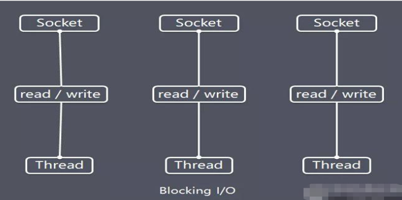

## Netty的介绍

> Netty 是由 JBOSS 提供的一个 Java 开源框架，现为 Github上的独立项目。
> Netty 是一个`异步的`、`基于事件驱动`的网络应用框架，用以快速开发高性能、高可靠性的网络 IO 程序。
> Netty主要针对在TCP协议下，面向Clients端的高并发应用，或者Peer-to-Peer场景下的大量数据持续传输的应用。
> Netty本质是一个NIO框架，适用于服务器通讯相关的多种应用场景

### 异步和事件驱动

所有的网络应用程序需要被设计为可扩展性，可以被界定为“一个系统，网络能力，或过程中能够处理越来越多的工作方式或可扩大到容纳增长的能力”（见 Bondi, André B. (2000). "Characteristics of scalability and their impact on performance"）。我们已经说过，Netty 帮助您利用非阻塞 I/O 完成这一目标，通常称为“异步 I/O”

我们将使用“异步”和其同源词在这本书中大量的使用，所以这是介绍他们的一个很好的时候。异步，即非同步事件，当然是跟你日常生活的类似。例如，您可以发送电子邮件；可能得到或者得不到任何回应，或者当你发送一个您可能会收到一个消息。异步事件也可以有一个有序的关系。例如，你通常不会收到一个问题的答案直到提出一个问题，但是你并没有阻止同时一些其他的东西。

在日常生活中异步就这样发生了，所以我们不会经常想到。但让计算机程序的工作方式，来实现我们提出了的特殊的问题，会有一点复杂。在本质上，一个系统是异步和“事件驱动”将会表现出一个特定的，对我们来说，有价值的 行为：它可以响应在任何时间以任何顺序发生的事件。

这是我们要建立一种制度，正如我们将会看到，这是典范的 Netty 自底向上的支持。

## I/O 模型基本说明

I/O 模型简单的理解：就是用什么样的通道进行数据的发送和接收，很大程度上决定了程序通信的性能
Java共支持3种网络编程模型/IO模式：BIO、NIO、AIO

### Java BIO
同步并阻塞(传统阻塞型)，服务器实现模式为一个连接一个线程，即客户端有连接请求时服务器端就需要启动一个线程进行处理，
如果这个连接不做任何事情会造成不必要的线程开销。

BIO方式适用于`连接数目比较小且固定的架构`，这种方式对服务器资源要求比较高，并发局限于应用中，JDK1.4以前的唯一选择，但程序简单易理解。

### Java NIO 
同步非阻塞，服务器实现模式为一个线程处理多个请求(连接)，即客户端发送的连接请求都会注册到多路复用器上，
多路复用器轮询到连接有I/O请求就进行处理 。
NIO方式适用于`连接数目多且连接比较短（轻操作）的架构`，比如聊天服务器，弹幕系统，服务器间通讯等。编程比较复杂，JDK1.4开始支持

### Java AIO(NIO.2)
异步非阻塞，AIO 引入异步通道的概念，采用了 Proactor 模式，简化了程序编写，有效的请求才启动线程，
它的特点是先由操作系统完成后才通知服务端程序启动线程去处理，一般适用于连接数较多且连接时间较长的应用.
AIO方式使用于`连接数目多且连接比较长（重操作）的架构`，比如相册服务器，充分调用OS参与并发操作，编程比较复杂，JDK7开始支持。
