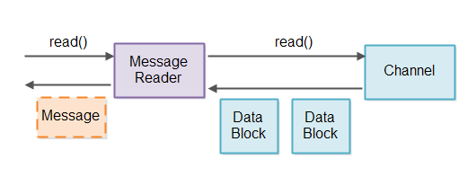

即使你知道Java NIO 非阻塞的工作特性（如Selector,Channel,Buffer等组件），但是想要设计一个非阻塞的服务器仍然是一件很困难的事。非阻塞式服务器相较于阻塞式来说要多上许多挑战。本文将会讨论非阻塞式服务器的主要几个难题，并针对这些难题给出一些可能的解决方案。

查找关于非阻塞式服务器设计方面的资料实在不太容易，所以本文提供的解决方案都是基于本人工作和想法上的。如果各位有其他的替代方案或者更好的想法，我会很乐意听取这些方案和想法！你可以在文章下方留下你的评论，或者发邮件给我（邮箱为：info@jenkov.com ）。

本文的设计思路想法都是基于Java NIO的。但是我相信如果某些语言中也有像Selector之类的组件的话，文中的想法也能用于该语言。据我所知，类似的组件底层操作系统会提供，所以对你来说也可以根据其中的思想运用在其他语言上。

 

## 非阻塞式服务器– GitHub 仓库
我已经创建了一些简单的这些思想的概念验证呈现在这篇教程中，并且为了让你可以看到，我把源码放到了github资源库上了。这里是GitHub资源库地址:

https://github.com/jjenkov/java-nio-server 

 

## 非阻塞式IO管道(Pipelines)
一个非阻塞式IO管道是由各个处理非阻塞式IO组件组成的链。其中包括读/写IO。下图就是一个简单的非阻塞式IO管道组成：

一个组件使用 Selector 监控 Channel 什么时候有可读数据。然后这个组件读取输入并且根据输入生成相应的输出。最后输出将会再次写入到一个Channel中。

一个非阻塞式IO管道不需要将读数据和写数据都包含，有一些管道可能只会读数据，另一些可能只会写数据。

上图仅显示了一个单一的组件。一个非阻塞式IO管道可能拥有超过一个以上的组件去处理输入数据。一个非阻塞式管道的长度是由他的所要完成的任务决定。

一个非阻塞IO管道可能同时读取多个Channel里的数据。举个例子：从多个SocketChannel管道读取数据。

其实上图的控制流程还是太简单了。这里是组件从Selector开始从Channel中读取数据，而不是Channel将数据推送给Selector进入组件中，即便上图画的就是这样。

 

## 非阻塞式vs. 阻塞式管道
非阻塞和阻塞IO管道两者之间最大的区别在于他们如何从底层Channel(Socket或者file)读取数据。

IO管道通常从流中读取数据（来自socket或者file）并且将这些数据拆分为一系列连贯的消息。这和使用tokenizer（这里估计是解析器之类的意思）将数据流解析为token（这里应该是数据包的意思）类似。相反你只是将数据流分解为更大的消息体。我将拆分数据流成消息这一组件称为“消息读取器”（Message Reader）下面是Message Reader拆分流为消息的示意图：

一个阻塞IO管道可以使用类似InputStream的接口每次一个字节地从底层Channel读取数据，并且这个接口阻塞直到有数据可以读取。这就是阻塞式Message Reader的实现过程。

使用阻塞式IO接口简化了Message Reader的实现。阻塞式Message Reader从不用处理在流没有数据可读的情况，或者它只读取流中的部分数据并且对于消息的恢复也要延迟处理的情况。

同样，阻塞式Message Writer(一个将数据写入流中组件)也从不用处理只有部分数据被写入和写入消息要延迟恢复的情况。

 

## 阻塞式IO管道的缺陷

虽然阻塞式Message Reader容易实现，但是也有一个不幸的缺点：每一个要分解成消息的流都需要一个独立的线程。必须要这样做的理由是每一个流的IO接口会阻塞，直到它有数据读取。这就意味着一个单独的线程是无法尝试从一个没有数据的流中读取数据转去读另一个流。一旦一个线程尝试从一个流中读取数据，那么这个线程将会阻塞直到有数据可以读取。

如果IO管道是必须要处理大量并发链接服务器的一部分的话，那么服务器就需要为每一个链接维护一个线程。对于任何时间都只有几百条并发链接的服务器这确实不是什么问题。但是如果服务器拥有百万级别的并发链接量，这种设计方式就没有良好收放。每个线程都会占用栈32bit-64bit的内存。所以一百万个线程占用的内存将会达到1TB！不过在此之前服务器将会把所有的内存用以处理传经来的消息（例如：分配给消息处理期间使用对象的内存）

为了将线程数量降下来，许多服务器使用了服务器维持线程池（例如：常用线程为100）的设计，从而一次一个地从入站链接（inbound connections）地读取。入站链接保存在一个队列中，线程按照进入队列的顺序处理入站链接。这一设计如下图所示：(译者注：Tomcat就是这样的)

然而，这一设计需要入站链接合理地发送数据。如果入站链接长时间不活跃，那么大量的不活跃链接实际上就造成了线程池中所有线程阻塞。这意味着服务器响应变慢甚至是没有反应。

一些服务器尝试通过弹性控制线程池的核心线程数量这一设计减轻这一问题。例如，如果线程池线程不足时，线程池可能开启更多的线程处理请求。这一方案意味着需要大量的长时链接才能使服务器不响应。但是记住，对于并发线程数任然是有一个上限的。因此，这一方案仍然无法很好地解决一百万个长时链接。

基础非阻塞式IO管道设计
一个非阻塞式IO管道可以使用一个单独的线程向多个流读取数据。这需要流可以被切换到非阻塞模式。在非阻塞模式下，当你读取流信息时可能会返回0个字节或更多字节的信息。如果流中没有数据可读就返回0字节，如果流中有数据可读就返回1+字节。

为了避免检查没有可读数据的流我们可以使用 Java NIO Selector. 一个或多个SelectableChannel 实例可以同时被一个Selector注册.。当你调用Selector的select()或者 selectNow() 方法它只会返回有数据读取的SelectableChannel的实例. 下图是该设计的示意图：

## 读取部分消息
当我们从一个SelectableChannel读取一个数据包时，我们不知道这个数据包相比于源文件是否有丢失或者重复数据（原文是：When we read a block of data from a SelectableChannel we do not know if that data block contains less or more than a message）。一个数据包可能的情况有：缺失数据（比原有消息的数据少）、与原有一致、比原来的消息的数据更多（例如：是原来的1.5或者2.5倍）。数据包可能出现的情况如下图所示：

在处理类似上面这样部分信息时，有两个问题:

1. 判断你是否能在数据包中获取完整的消息。
2. 在其余消息到达之前如何处理已到达的部分消息。

判断消息的完整性需要消息读取器（Message Reader）在数据包中寻找是否存在至少一个完整消息体的数据。如果一个数据包包含一个或多个完整消息体，这些消息就能够被发送到管道进行处理。寻找完整消息体这一处理可能会重复多次，因此这一操作应该尽可能的快。

判断消息完整性和存储部分消息都是消息读取器(Message Reader)的责任。为了避免混合来自不同Channel的消息，我们将对每一个Channel使用一个Message Reader。设计如下图所示:

在从Selector得到可从中读取数据的Channel实例之后, 与该Channel相关联的Message Reader读取数据并尝试将他们分解为消息。这样读出的任何完整消息可以被传到读取通道(read pipeline)任何需要处理这些消息的组件中。

一个Message Reader一定满足特定的协议。Message Reader需要知道它尝试读取的消息的消息格式。如果我们的服务器可以通过协议来复用，那它需要有能够插入Message Reader实现的功能 – 可能通过接收一个Message Reader工厂作为配置参数。

 

## 存储部分消息
现在我们已经确定Message Reader有责任存储部分消息，直到收到完整的消息，我们需要弄清楚这些部分消息的存储应该如何实现。

有两个设计因素我们要考虑：

1. 我们想尽可能少地复制消息数据。复制越多，性能越低。
2. 我们希望将完整的消息存储在连续的字节序列中，使解析消息更容易。

### 每个Message Reader的缓冲区

很显然部分消息需要存储某些缓冲区中。简单的实现方式可以是每一个Message Reader内部简单地有一个缓冲区。但是这个缓冲区应该多大？它要大到足够储存最大允许储存消息。因此，如果最大允许储存消息是1MB，那么Message Reader内部缓冲区将至少需要1MB。

当我们的链接达到百万数量级，每个链接都使用1MB并没有什么作用。1,000,000 * 1MB仍然是1TB的内存！那如果最大的消息是16MB甚至是128MB呢？

 

### 大小可调的缓冲区

另一个选择是在Message Reader内部实现一个大小可调的缓冲区。大小可调的缓冲区开始的时候很小，如果它获取的消息过大，那缓冲区会扩大。这样每一条链接就不一定需要如1MB的缓冲区。每条链接的缓冲区只要需要足够储存下一条消息的内存就行了。

有几个可实现可调大小缓冲区的方法。它们都各自有自己的优缺点，所以接下来的部分我将逐个讨论。

 

### 通过复制调整大小

实现可调大小缓冲区的第一种方式是从一个大小(例如:4KB)的缓冲区开始。如果4KB的缓冲区装不下一个消息，则会分配一个更大的缓冲区(如:8KB),并将大小为4KB的缓冲区数据复制到这个更大的缓冲区中去。

通过复制实现大小可调缓冲区的优点在于消息的所有数据被保存在一个连续的字节数组中，这就使得消息的解析更加容易。它的缺点就是在复制更大消息的时候会导致大量的数据。

为了减少消息的复制，你可以分析流进你系统的消息的大小，并找出尽量减少复制量的缓冲区的大小。例如，你可能看到大多数消息都小于4KB，这是因为它们都仅包含很小的 request/responses。这意味着缓冲区的初始值应该设为4KB。

然后你可能有一个消息大于4KB，这通常是因为它里面包含一个文件。你可能注意到大多数流进系统的文件都是小于128KB的。这样第二个缓冲区的大小设置为128KB就较为合理。

最后你可能会发现一旦消息超过128KB之后，消息的大小就没有什么固定的模式，因此缓冲区最终的大小可能就是最大消息的大小。

根据流经系统的消息大小，上面三种缓冲区大小可以减少数据的复制。小于4KB的消息将不会复制。对于一百万个并发链接其结果是：1,000,000 * 4KB = 4GB，对于目前大多数服务器还是有可能的。介于4KB – 128KB的消息将只会复制一次，并且只有4KB的数据复制进128KB的缓冲区中。介于128KB至最大消息大小的消息将会复制两次。第一次复制4KB，第二次复制128KB，所以最大的消息总共复制了132KB。假设没有那么多超过128KB大小的消息那还是可以接受的。

一旦消息处理完毕，那么分配的内存将会被清空。这样在同一链接接收到的下一条消息将会再次从最小缓冲区大小开始算。这样做的必要性是确保了不同连接间内存的有效共享。所有的连接很有可能在同一时间并不需要打的缓冲区。

我有一篇介绍如何实现这样支持可调整大小的数组的内存缓冲区的完整文章:

Resizable Arrays(http://tutorials.jenkov.com/java-performance/resizable-array.html)

文章包含一个GitHub仓库连接，其中的代码演示了是如何实现的。

 

### 通过追加调整大小

调整缓冲区大小的另一种方法是使缓冲区由多个数组组成。当你需要调整缓冲区大小时，你只需要另一个字节数组并将数据写进去就行了。

这里有两种方法扩张一个缓冲区。一个方法是分配单独的字节数组，并将这些数组保存在一个列表中。另一个方法是分配较大的共享字节数组的片段，然后保留分配给缓冲区的片段的列表。就个人而言，我觉得片段的方式会好些，但是差别不大。

通过追加单独的数组或片段来扩展缓冲区的优点在于写入过程中不需要复制数据。所有的数据可以直接从socket (Channel)复制到一个数组或片段中。

以这种方式扩展缓冲区的缺点是在于数据不是存储在单独且连续的数组中。这将使得消息的解析更困难，因为解析器需要同时查找每个单独数组的结尾处和所有数组的结尾处。由于你需要在写入的数据中查找消息的结尾，所以该模型并不容易使用。

 

## TLV编码消息
一些协议消息格式是使用TLV格式（类型(Type)、长度(Length)、值(Value)）编码。这意味着当消息到达时，消息的总长度被存储在消息的开头。这一方式你可以立即知道应该对整个消息分配多大的内存。

TLV编码使得内存管理变得更加容易。你可以立即知道要分配多大的内存给这个消息。只有部分在结束时使用的缓冲区才会使得内存浪费。

TLV编码的一个缺点是你要在消息的所有数据到达之前就分配好这个消息需要的所有内存。一些慢连接可能因此分配完你所有可用内存，从而使得你的服务器无法响应。

此问题的解决方法是使用包含多个TLV字段的消息格式。因此，服务器是为每个字段分配内存而不是为整个消息分配内存，并且是字段到达之后再分配内存。然而，一个大消息中的一个大字段在你的内存管理有同样的影响。

另外一个方案就是对于还未到达的信息设置超时时间，例如10-15秒。当恰好有许多大消息到达服务器时，这个方案能够使得你的服务器可以恢复，但是仍然会造成服务器一段时间无法响应。另外，恶意的DoS（Denial of Service拒绝服务）攻击仍然可以分配完你服务器的所有内存。

TLV编码存在许多不同的形式。实际使用的字节数、自定字段的类型和长度都依赖于每一个TLV编码。TLV编码首先放置字段的长度、然后是类型、然后是值（一个LTV编码）。 虽然字段的顺序不同，但它仍然是TLV的一种。

TLV编码使内存管理更容易这一事实，其实是HTTP 1.1是如此可怕的协议的原因之一。 这是他们试图在HTTP 2.0中修复数据的问题之一，数据在LTV编码帧中传输。 这也是为什么我们使用TLV编码的VStack.co project 设计了我们自己的网络协议。

 

## 写部分数据
在非阻塞IO管道中写数据仍然是一个挑战。当你调用一个处于非阻塞式Channel对象的write(ByteBuffer)方法时，ByteBuffer写入多少数据是无法保证的。write（ByteBuffer）方法会返回写入的字节数，因此可以跟踪写入的字节数。这就是挑战：跟踪部分写入的消息，以便最终可以发送一条消息的所有字节。

为了管理部分消息写入Channel，我们将创建一个消息写入器（Message Writer）。就像Message Reader一样，每一个要写入消息的Channel我们都需要一个Message Writer。在每个Message Writer中，我们跟踪正在写入的消息的字节数。

如果达到的消息量超过Message Writer可直接写入Channel的消息量，消息就需要在Message Writer排队。然后Message Writer尽快地将消息写入到Channel中。

下图是部分消息如何写入的设计图：

 

 

为了使Message Writer能够尽快发送数据，Message Writer需要能够不时被调用，这样就能发送更多的消息。

如果你又大量的连接那你将需要大量的Message Writer实例。检查Message Writer实例(如:一百万个)看写任何数据时是否缓慢。 首先，许多Message Writer实例都没有任何消息要发送，我们并不想检查那些Message Writer实例。其次，并不是所有的Channel实例都可以准备好写入数据。 我们不想浪费时间尝试将数据写入无法接受任何数据的Channel。

为了检查Channel是否准备好进行写入，您可以使用Selector注册Channel。然而我们并不想将所有的Channel实例注册到Selector中去。想象一下，如果你有1,000,000个连接且其中大多是空闲的，并且所有的连接已经与Selector注册。然后当你调用select()时，这些Channel实例的大部分将被写入就绪（它们大都是空闲的，记得吗？）然后你必须检查所有这些连接的Message Writer，以查看他们是否有任何数据要写入。

为了避免检查所有消息的Message Writer实例和所有不可能被写入任何信息的Channel实例，我们使用这两步的方法：

1. 当一个消息被写入Message Writer，Message Writer向Selector注册其相关Channel（如果尚未注册）。
2. 当你的服务器有时间时，它检查Selector以查看哪些注册的Channel实例已准备好进行写入。 对于每个写就绪Channel，请求其关联的Message Writer将数据写入Channel。 如果Message Writer将其所有消息写入其Channel，则Channel将再次从Selector注册。

这两个小步骤确保了有消息写入的Channel实际上已经被Selector注册了。

 

## 汇总
正如你所见，一个非阻塞式服务器需要时不时检查输入的消息来判断是否有任何的新的完整的消息发送过来。服务器可能会在一个或多个完整消息发来之前就检查了多次。检查一次是不够的。

同样，一个非阻塞式服务器需要时不时检查是否有任何数据需要写入。如果有，服务器需要检查是否有任何相应的连接准备好将该数据写入它们。只有在第一次排队消息时才检查是不够的，因为消息可能被部分写入。

所有这些非阻塞服务器最终都需要定期执行的三个“管道”（pipelines）：:

+ 读取管道（The read pipeline），用于检查是否有新数据从开放连接进来的。
+ 处理管道(The process pipeline)，用于所有任何完整消息。
+ 写入管道（The write pipeline），用于检查是否可以将任何传出的消息写入任何打开的连接。

这三条管道在循环中重复执行。你可能可以稍微优化执行。例如，如果没有排队的消息可以跳过写入管道。 或者，如果我们没有收到新的，完整的消息，也许您可以跳过流程管道。

以下是说明完整服务器循环的图：

如果仍然发现这有点复杂，请记住查看GitHub资料库：https://github.com/jjenkov/java-nio-server

也许看到正在执行的代码可能会帮助你了解如何实现这一点。

 

## 服务器线程模型
GitHub资源库里面的非阻塞式服务器实现使用了两个线程的线程模式。第一个线程用来接收来自ServerSocketChannel的传入连接。第二个线程处理接受的连接，意思是读取消息，处理消息并将响应写回连接。这两个线程模型的图解如下：

上一节中说到的服务器循环处理是由处理线程（Processor Thread）执行。