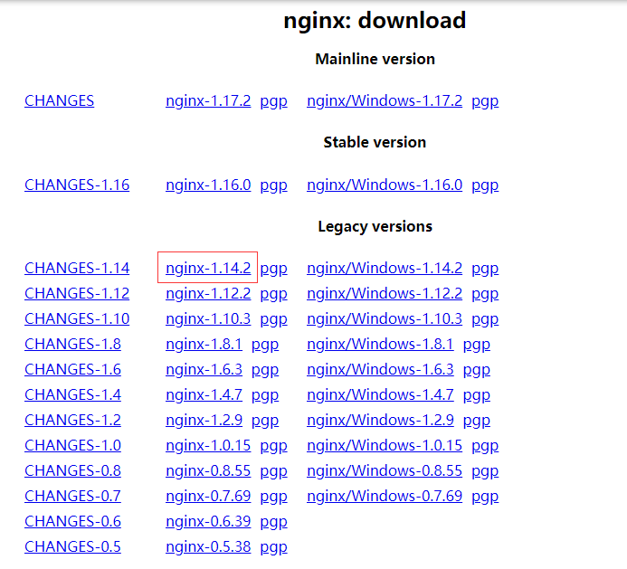

Nginx是一款自由的、开源的、高性能的HTTP服务器和反向代理服务器；同时也是一个IMAP、POP3、SMTP代理服务器；Nginx可以作为一个HTTP服务器进行网站的发布处理，另外Nginx可以作为反向代理进行负载均衡的实现。

<!--more-->

## 1 、安装相关的依赖包
### 1.1  gcc安装 
> 安装 nginx 需要先将官网下载的源码进行编译，编译依赖 gcc 环境

    [root@VM_0_3_centos src]# yum -y install gcc-c++

### 1.2 pcre安装
> nginx 的 http 模块使用 pcre 来解析正则表达式，所以需要安装 pcre 库

    [root@VM_0_3_centos src]# yum  -y install  pcre pcre-devel

​    
### 1.3 zlib安装
> zlib 库提供了很多种压缩和解压缩的方式， nginx 使用 zlib 对 http 包的内容进行 gzip

	[root@VM_0_3_centos src]# yum -y install zlib zlib-devel

### 1、4 OpenSSL安装

> OpenSSL 是一个强大的安全套接字层密码库，囊括主要的密码算法、常用的密钥和证书封装管理功能及 SSL 协议，并提供丰富的应用程序供测试或其它目的使用。
> nginx 不仅支持 http 协议，还支持 https（即在ssl协议上传输http），所以需要在 Centos 安装 OpenSSL 库。

    [root@VM_0_3_centos src]# yum -y install openssl openssl-devel  
​    

## 2、下载nginx 安装包
 ### 2.1 到官网下载

​		
下载网址：<https://nginx.org/en/download.html/>
​        
选择最新稳定版nginx-1.17.2 

### 2.2 使用wget命令下载

    [root@VM_0_3_centos src]# wget -c https://nginx.org/download/nginx-1.17.2.tar.gz

> 如果没有wget命令则安装：

    [root@VM_0_3_centos src]# yum -y install wget nginx-1.17.2.tar.gz

### 3、 解压安装

> 复制包到你的安装目录

    [root@VM_0_3_centos src]# cp nginx-1.17.2.tar.gz /usr/local/

> 解压并删除压缩包

    [root@VM_0_3_centos src]#  tar -zxvf nginx-1.17.2.tar.gz
    [root@VM_0_3_centos src]#  rm -r  nginx-1.17.2.tar.gz

### 4、编译安装

 	[root@VM_0_3_centos src]#  cd nginx-1.17.2/

   > 进行configure配置

    [root@VM_0_3_centos src]# ./configure --prefix=/usr/local/nginx

  >编译并安装

    [root@VM_0_3_centos src]#  make && make install

### 5、常用命令

> 建立软连接

	[root@VM_0_3_centos src]# ln -s /usr/local/nginx/sbin/nginx /usr/local/bin/

> 启动

    nginx -s quit       优雅停止nginx，有连接时会等连接请求完成再杀死worker进程  
    nginx -s reload     优雅重启，并重新载入配置文件nginx.conf
    nginx -s reopen     重新打开日志文件，一般用于切割日志
    nginx -v            查看版本  
    nginx -t            检查nginx的配置文件
    nginx -h            查看帮助信息
    nginx -V            详细版本信息，包括编译参数 
    nginx  -c filename  指定配置文件